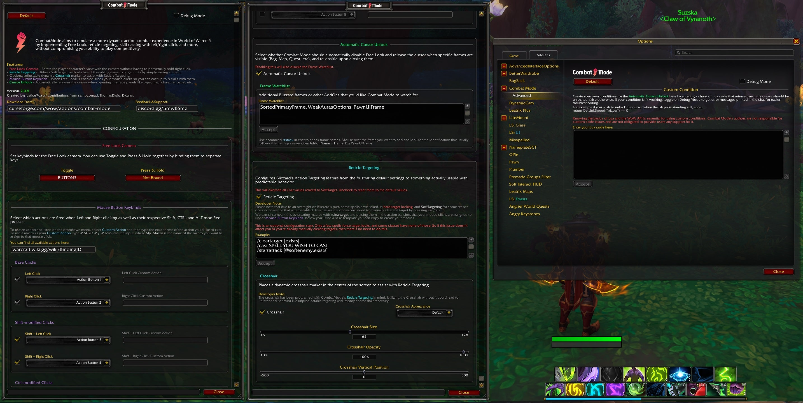

  

CombatMode aims to emulate a more dynamic action combat experience in World of Warcraft by implementing [Free Look](https://en.wikipedia.org/wiki/Free_look), reticle targeting, skill casting with left/right click, and more, without compromising your ability to play competitively.

 

## Features
- [Free Look](https://en.wikipedia.org/wiki/Free_look) - Rotate the player character's view with the camera without having to perpetually hold right click.
- Reticle Targeting - Utilizes SoftTarget methods from DF enabling users to target units by simply aiming at them.
- Optional adjustable dynamic Crosshair marker to assist with Reticle Targeting.
- Mouse Button Keybinds - When Free Look is enabled, frees your mouse clicks so you can cast up to 8 skills with them.
- Cursor Unlock - Automatically releases the cursor when opening interface panels like bags, map, character panel, etc.

 

## Download

Grab it on [**CurseForge**](https://www.curseforge.com/wow/addons/combat-mode).

 

## Instructions

After installing the AddOn, you'll be greeted by this message upon login:

1. You can use these commands or go to Game Menu (ESC) > Options > AddOns > Combat Mode.
2. In the options panel, you'll be able to set up a key to enable Combat Mode, through either a toggle (on/off) style or press & hold.
3. When toggled off, your mouse buttons are remapped to what they were originally.

#### Combat Mode has built-in compatibility with popular addons like:
- [**Opie**](https://www.curseforge.com/wow/addons/opie).
- [**Narcissus**](https://www.curseforge.com/wow/addons/narcissus).
- [**Immersion**](https://legacy.curseforge.com/wow/addons/immersion).
- [**BagNon**](https://www.curseforge.com/wow/addons/bagnon).
- [**GW2-ui**](https://www.curseforge.com/wow/addons/gw2-ui).
- [**WeakAuras**](https://www.curseforge.com/wow/addons/weakauras-2).

 

## Feedback & Support

Talk to us on [**Discord**](https://www.discord.gg/5mwBSmz).

 

## Source Code & Contributing

You can submit a PR with your contributions to [**Combat Mode's repository on GitHub**](https://github.com/djsmithdev/combatmode).

 

## Showcase Video

 

## Preview Images

 
