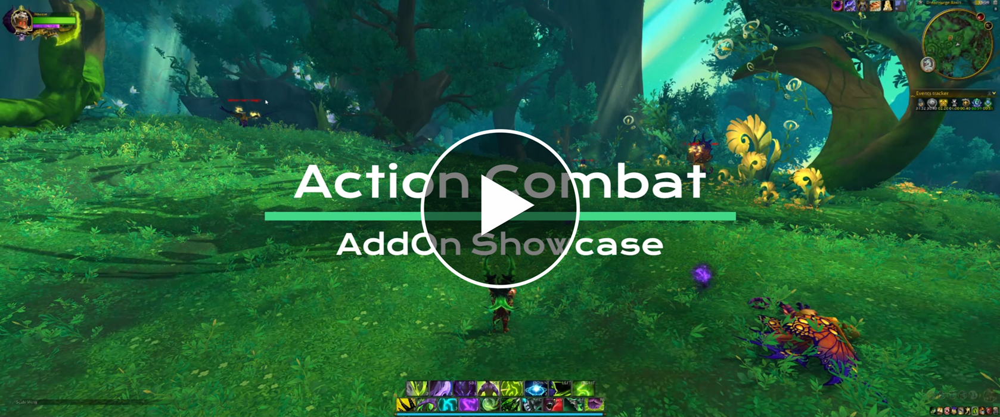
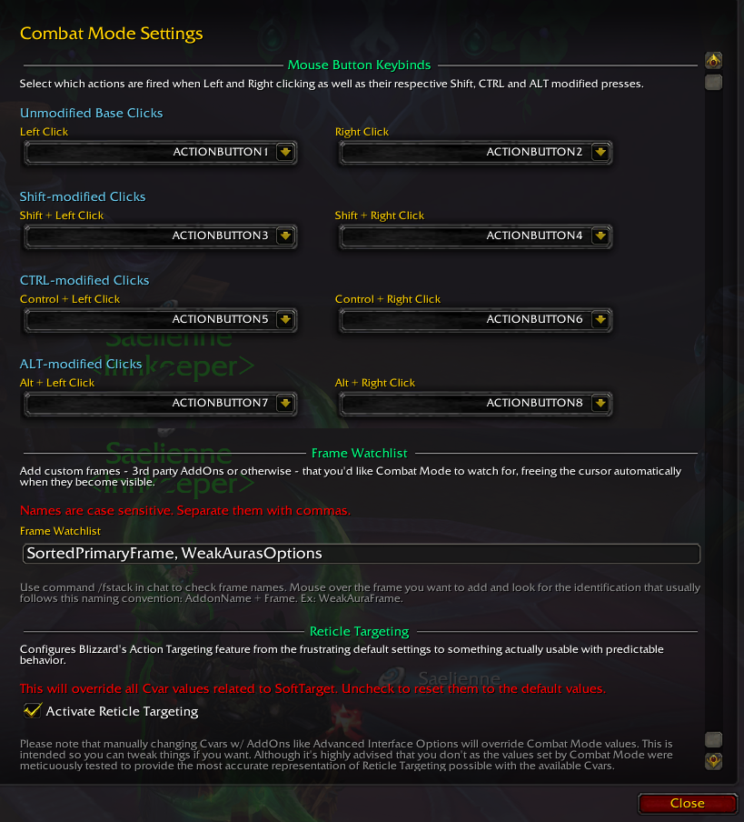

# **Combat Mode**
AddOn for World of Warcraft that adds Action Combat (Free Look, Reticle Targeting, ability casting w/ mouse click) to the game for a more dynamic combat experience.

Based on the great work done on the original [Combat Mode](https://www.curseforge.com/wow/addons/combat-mode) AddOn.

 

## Features
- [Free Look](https://en.wikipedia.org/wiki/Free_look) - Move your camera without having to perpetually hold right mouse button.
- Reticle Targeting - Makes use of the SoftTarget Cvars added with Dragonflight to allow the user to target units by aiming at them.
- Ability casting w/ mouse click - When Combat Mode is enabled, frees your left and right mouse click so you can cast abilities with them.
- Automatically toggles Free Look when opening interface panels like bags, map, character panel, etc.
- Ability to add any custom frame - 3rd party AddOns or otherwise - to a watchlist to expand on the default selection.

 

## Download

Grab it on [**CurseForge**](https://www.curseforge.com/wow/addons/combat-mode).

 

## Showcase Video

 

## In-game Configuration

 

 
