

  

<strong>Combat Mode</strong> brings modern action-game controls to <em>World of Warcraft</em>, replacing traditional tab-targeting with intuitive aiming, more engaging controls, and immersive combat..

  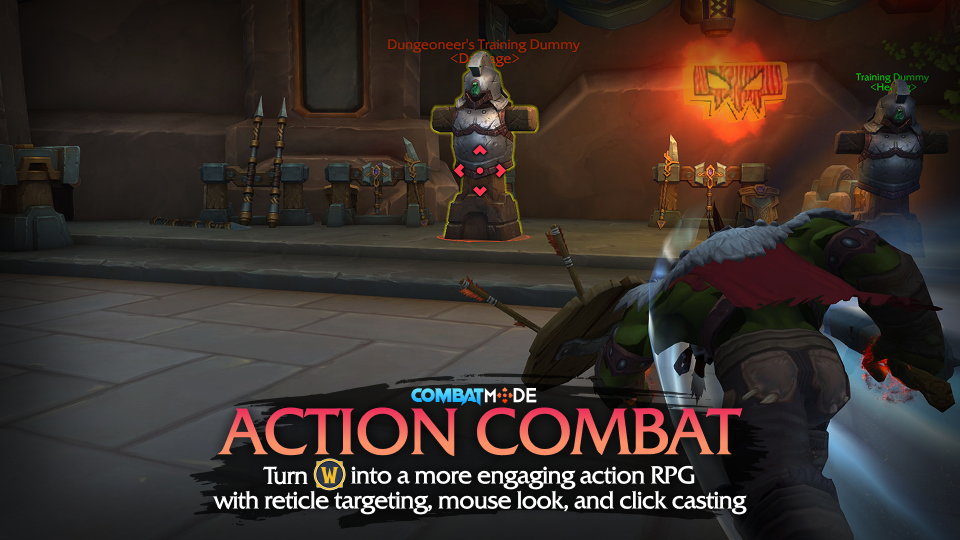

 

##  FEATURES

### Mouse Look
Lock your cursor to the center of the screen and control your character by simply moving the mouse—no more holding right-click to turn. Toggle Mouse Look on permanently, or hold a key to temporarily free the cursor whenever you need it.

  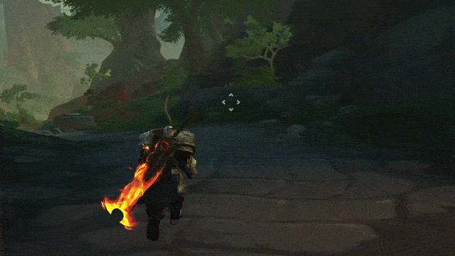

### Reticle Targeting
Target enemies by simply aiming at them. Combat Mode's reticle targeting replaces traditional tab-targeting with an action-inspired system that also supports automatic ground targeting for AoE abilities, casting them exactly where you aim.

  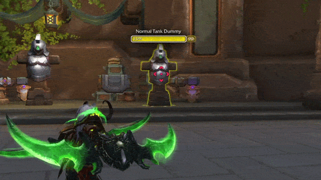

### Dynamic Crosshair
The crosshair is the heart of Combat Mode—a fully reactive, intelligent HUD that adapts to your target and combat state in real time, delivers rich contextual feedback, and is fully customizable.

  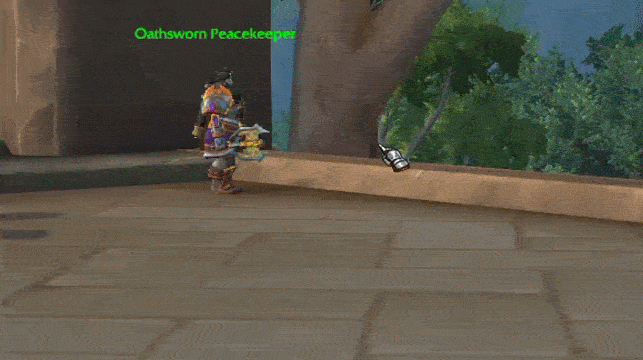

### Click Casting
Bind left-click, right-click, and modifier combinations directly to your rotation. While Mouse Look is active, every click becomes an instant spell cast, giving you up to eight actions at your fingertips without touching your action bars.

  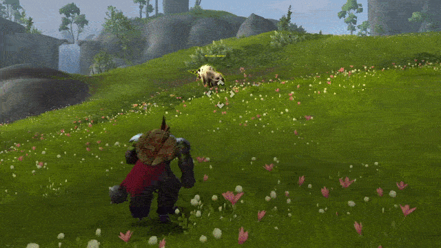

### Target Lock & Cycle
Lock onto a target with a single tap to prevent the reticle from switching unexpectedly. Tap again to release it. While locked, use the mouse wheel to cycle nearby enemies, making it easy to prioritize targets in crowded encounters.

  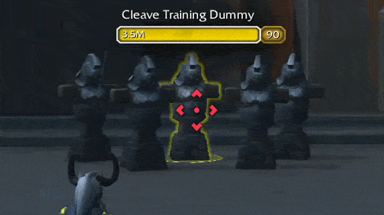

### Combat Assist
Displays Blizzard's Assisted Combat next-cast suggestion directly beside the crosshair, complete with satisfying cast-success feedback. Keep your rotation readable without staring at the action bar.

  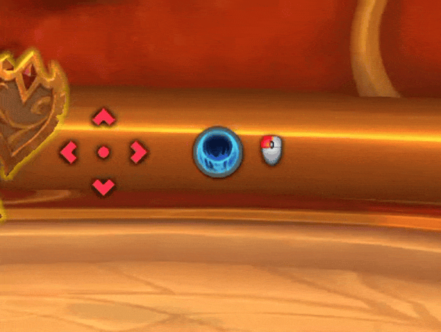

### Interaction HUD
When your reticle passes over an NPC, quest object, or other interactable, a contextual, range-aware indicator appears beside the crosshair so you always know when something is within reach.

  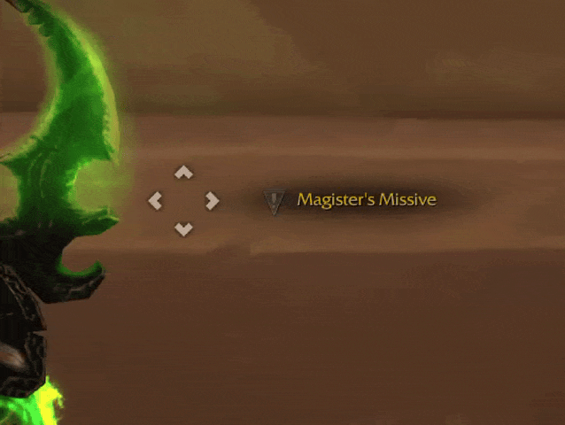

### Party Radial
Hold a key during Mouse Look to instantly open a radial menu for your party. Select a teammate to target and cast supportive abilities without ever leaving Mouse Look. Integrated health, range, and status indicators help you react quickly when every second counts.

  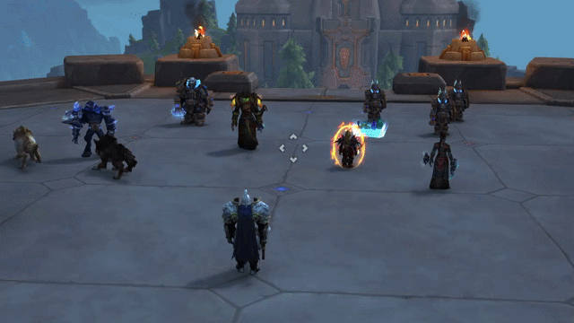

### Auto Unlock
Mouse Look automatically disengages whenever you open bags, the map, your character panel, or other interface windows, then seamlessly resumes when you're finished. You can even define your own UI frames and custom conditions to trigger Auto Unlock.

  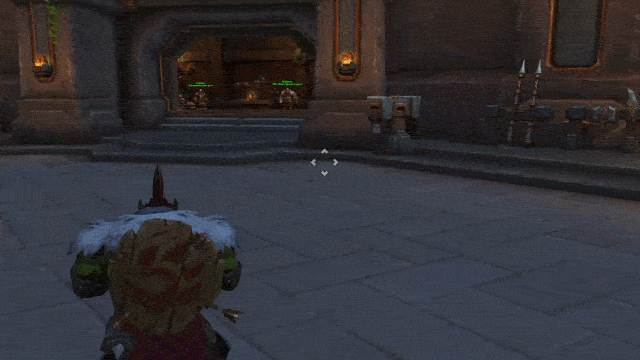

### Action Camera
Enhance immersion with an optional, fully customizable action camera that delivers a more dynamic third-person perspective, making combat feel faster, weightier, and more cinematic.

  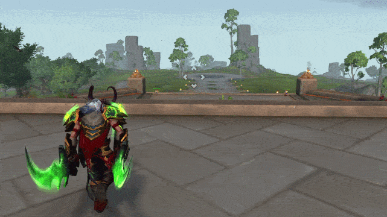

 

##  DOWNLOAD

Grab it on [**CurseForge**](https://www.curseforge.com/wow/addons/combat-mode) or [**Wago Addons**](https://addons.wago.io/addons/combat-mode).

 

##  INSTRUCTIONS

After installing the AddOn, you'll be greeted by this message upon your first login on each character:

  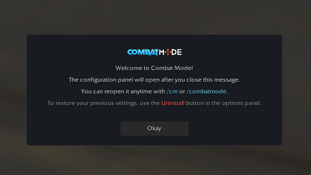

1. Click Okay to proceed or go to Game Menu (ESC) > Options > AddOns > Combat Mode.
2. In the options panel, you'll be able to configure the addon to your liking.

<strong>Please, take your time reading what each option does, their tooltips and dev notes. They answer the majority of the most commonly asked questions.</strong>

 

##  SUPPORT

You can report bugs, request features and provide feedback over on our [**Discord**](https://www.discord.gg/5mwBSmz).

 

##  ARCHITECTURE

Combat Mode is organized by **domain**. Runtime lives under `CombatMode/Core/`; settings under `CombatMode/UI/`; static tables under `CombatMode/Constants/`.

| Domain | Owns |
|--------|------|
| **Runtime** | AddOn shell, events, CVars, binding queue, bootstrap (`Core/Runtime/`) |
| **FreeLook** | Mouse look / mouselook state + auto cursor unlock |
| **Crosshair** | Reticle, Interaction HUD, Combat Assist, Target Lock focus marker, cast animations |
| **ClickCasting** | Mouse override bindings + targeting macro builder |
| **PartyRadial** | Hold-to-open party radial (secure slices, health, roles) |
| **Options toolkit** | Standalone options window + editors (`UI/Options/`, `UI/Editors/`) |

Load order and public entry points: **[STRUCTURE.md](STRUCTURE.md)**. Agent/contributor rules: **[AGENTS.md](AGENTS.md)**.

 

##  CONTRIBUTING

You can submit a PR with your contributions to [**Combat Mode's repository on GitHub**](https://github.com/djsmithdev/combatmode).

### Developer quickstart

1. Clone and install the addon into your Retail `Interface/AddOns` folder for local testing.
2. Skim the [architecture table](#architecture) above, then [STRUCTURE.md](STRUCTURE.md) for load order.
3. Follow [CONTRIBUTING.md](CONTRIBUTING.md) — especially the **first-hour path** (change a toggle, add a constant, secret-value rules).
4. Run a focused manual pass from [TESTING.md](TESTING.md) for your changed features.
5. Open a PR and complete `.github/PULL_REQUEST_TEMPLATE.md`. Use [RELEASE.md](RELEASE.md) when shipping a version.

### Code Style & Linting

- Install [StyLua](https://github.com/JohnnyMorganz/StyLua) and [Selene](https://github.com/Kampfkarren/selene).
- Script index helper: `pwsh ./scripts/help.ps1`
- Setup sanity helper: `pwsh ./scripts/dev-check.ps1`
- Default changed-files helper: `pwsh ./scripts/lint-changed.ps1`
- Default local gate (changed files): `pre-commit run --files <changed files>`
- Tool-specific debug checks: `stylua --check <paths>`, `selene --config selene.toml <paths>`
- Install pre-commit hooks (recommended):
  - `pip install pre-commit`
  - `pre-commit install`
  - Release prep / full sweep only: `pre-commit run --all-files`

 