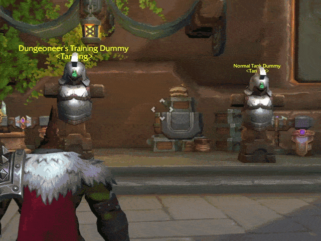
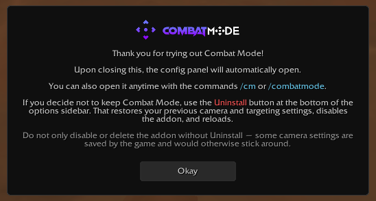

  

<strong>Combat Mode</strong> brings action combat to <em>World of Warcraft</em> — aim with a reticle, cast with mouse clicks, and keep your eyes on the fight instead of your bars.

  

 

##  FEATURES
- <strong>[Mouse Look](https://en.wikipedia.org/wiki/Free_look)</strong> - Lock the cursor to screen center and steer with the mouse — no more holding right-click to turn. Toggle it on, hold it when you need to temporarily free the cursor, and control your facing direction by simply moving the mouse. 
- <strong>Reticle Targeting</strong> - Aim the crosshair to target enemies and friendlies the way action games do. Built for `@cursor` and `@mouseover` macros, with optional Target Lock, automatic casting at crosshair location, spell exclusions, and advanced CVar / targeting-macro logic editors when you want full control.
- <strong>Target Lock & Cycle</strong> - Tap to lock your target, preventing the reticle from swapping it. Tap again to unlock. While a Target Lock is set, mouse wheel cycles nearby enemies and moves the lock, facilitating prioritization on stacked targets.
- <strong>Click Casting</strong> - Bind Left, Right, and modified mouse clicks to your rotation so every press under Mouse Look casts a spell — up to eight actions on your left and right click.
- <strong>Interaction HUD</strong> - When something under the reticle can be interacted with (NPCs, world objects, interactables), a clear icon appears beside the crosshair so you never miss a prompt mid-combat.
- <strong>Combat Assist</strong> - Shows Blizzard's Assisted Combat next-cast suggestion next to the crosshair, with satisfying cast-success feedback so your rotation stays readable without staring at the action bar.
- <strong>Action Camera</strong> - Optional dynamic camera preset that leans into that third-person action feel while Mouse Look is active.
- <strong>Auto Cursor Unlock</strong> - Automatically drops Mouse Look when you open bags, the map, character panel, and other UI — then snaps back when you're done so mouse look never fights your menus.
- <strong>Party Radial</strong> - Hold a key during Mouse Look to open a radial of your party: pick a slice to hard-target or cast helpful spells at group members, with health bars and role icons so triage stays fast.

 

##  DOWNLOAD

Grab it on [**CurseForge**](https://www.curseforge.com/wow/addons/combat-mode) or [**Wago Addons**](https://addons.wago.io/addons/combat-mode).

 

##  INSTRUCTIONS

After installing the AddOn, you'll be greeted by this message upon your first login on each character:

  

1. Click Okay to proceed or go to Game Menu (ESC) > Options > AddOns > Combat Mode.
2. In the options panel, you'll be able to configure the addon to your liking.

<strong>Please, take your time reading what each option does, their tooltips and dev notes. They answer the majority of the most commonly asked questions.</strong>

 

##  SUPPORT

You can report bugs, request features and provide feedback over on our [**Discord**](https://www.discord.gg/5mwBSmz).

 

##  ARCHITECTURE

Combat Mode is organized by **domain**. Runtime lives under `CombatMode/Core/`; settings under `CombatMode/UI/`; static tables under `CombatMode/Constants/`.

| Domain | Owns |
|--------|------|
| **Runtime** | AddOn shell, events, CVars, binding queue, bootstrap (`Core/Runtime/`) |
| **FreeLook** | Mouse look / mouselook state + auto cursor unlock |
| **Crosshair** | Reticle, Interaction HUD, Combat Assist, Target Lock focus marker, cast animations |
| **ClickCasting** | Mouse override bindings + targeting macro builder |
| **PartyRadial** | Hold-to-open party radial (secure slices, health, roles) |
| **Options toolkit** | Standalone options window + editors (`UI/Options/`, `UI/Editors/`) |

Load order and public entry points: **[STRUCTURE.md](STRUCTURE.md)**. Agent/contributor rules: **[AGENTS.md](AGENTS.md)**.

 

##  CONTRIBUTING

You can submit a PR with your contributions to [**Combat Mode's repository on GitHub**](https://github.com/djsmithdev/combatmode).

### Developer quickstart

1. Clone and install the addon into your Retail `Interface/AddOns` folder for local testing.
2. Skim the [architecture table](#architecture) above, then [STRUCTURE.md](STRUCTURE.md) for load order.
3. Follow [CONTRIBUTING.md](CONTRIBUTING.md) — especially the **first-hour path** (change a toggle, add a constant, secret-value rules).
4. Run a focused manual pass from [TESTING.md](TESTING.md) for your changed features.
5. Open a PR and complete `.github/PULL_REQUEST_TEMPLATE.md`. Use [RELEASE.md](RELEASE.md) when shipping a version.

### Code Style & Linting

- Install [StyLua](https://github.com/JohnnyMorganz/StyLua) and [Selene](https://github.com/Kampfkarren/selene).
- Script index helper: `pwsh ./scripts/help.ps1`
- Setup sanity helper: `pwsh ./scripts/dev-check.ps1`
- Default changed-files helper: `pwsh ./scripts/lint-changed.ps1`
- Default local gate (changed files): `pre-commit run --files <changed files>`
- Tool-specific debug checks: `stylua --check <paths>`, `selene --config selene.toml <paths>`
- Install pre-commit hooks (recommended):
  - `pip install pre-commit`
  - `pre-commit install`
  - Release prep / full sweep only: `pre-commit run --all-files`

 