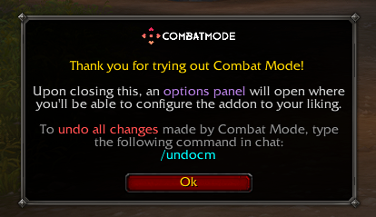
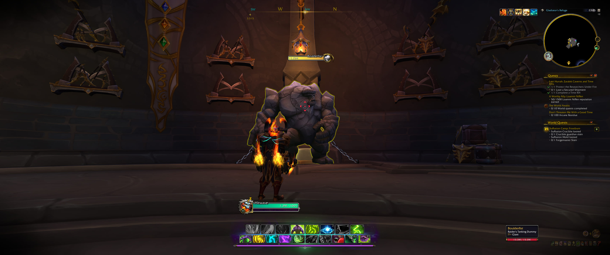

  

Introducing <strong>Combat Mode</strong> – an AddOn designed to bring a more dynamic action combat experience to <em>World of Warcraft</em> by implementing Free Look, Reticle Targeting, casting with mouse clicks, and more!

  

With a full suite of carefully programmed changes inspired by <ins>Guild Wars 2's Action Camera</ins> - <strong>all aimed at breathing some much-needed life into WoW's tab-targeting combat</strong> - Combat Mode introduces features like <ins>Free Look</ins>, allowing you to change your character’s facing direction by moving the mouse without needing to perpetually hold right-click. When enabled - either through a <em>toggle</em> or <em>press & hold</em> key bind - the cursor is locked to the center of the screen and transformed into a <ins>reticle capable of target selection</ins>, even supporting the use of <em>@cursor</em> or <em>@mouseover</em> macros.

Combat Mode takes it further by allowing you to <ins>cast spells with mouse clicks</ins>, a mechanic inspired by third-person action games. For convenience, the AddOn will <ins>automatically deactivate Free Look while interacting with a range of interface panels</ins>, reactivating it once closed.

Experience <em>World of Warcraft</em> like never before with <strong>Combat Mode</strong>!

 

##  FEATURES
- <strong>[Free Look Camera](https://en.wikipedia.org/wiki/Free_look)</strong> - Rotate the player character's view with the camera without having to perpetually hold right click.
- <strong>Reticle Targeting</strong> - Enable users to target units by simply aiming the reticle at them, as well as allowing proper use of @mouseover and @cursor macro decorators in combination with the crosshairs.
- <strong>Mouse Click Casting</strong> - When Free Look is enabled, frees your mouse clicks so you can cast up to 8 skills with them.
- <strong>Cursor Unlock</strong> - Automatically releases the cursor when opening interface panels like bags, map, character panel, etc.

 

##  DOWNLOAD

Grab it on [**CurseForge**](https://www.curseforge.com/wow/addons/combat-mode).

 

##  INSTRUCTIONS

After installing the AddOn, you'll be greeted by this message upon your first login on each character:

1. Click OK to proceed or go to Game Menu (ESC) > Options > AddOns > Combat Mode.
2. In the options panel, you'll be able to configure the addon to your liking.

<strong>Please, take your time reading what each option does, their tooltips and dev notes. They answer the majority of the most commonly asked questions.</strong>

 

##  PREVIEW

 

##  SUPPORT

Talk to us on [**Discord**](https://www.discord.gg/5mwBSmz).

 

##  CONTRIBUTING

You can submit a PR with your contributions to [**Combat Mode's repository on GitHub**](https://github.com/djsmithdev/combatmode).

 